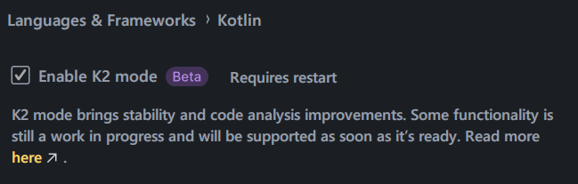
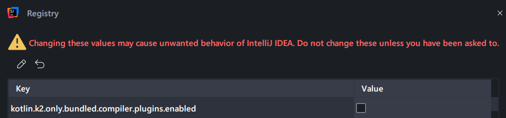

## KTools Compiler Plugin 
This project serves as a demonstration for some basic Kotlin Front End and Back End Compiler plugins. 

There are 4 modules as part of this plugin: 
1. `app` which serves as sample code to demonstrate the plugin capabilities
2. `compiler-plugin:ktools-plugin` which hosts the FE & BE Compiler plugins 
3. `compiler-plugin:ktools-runtime` runtime dependencies/code that the compiler plugins use. 
4. `gradle-plugin` a Gradle plugin that manages the compiler plugins and their settings. 

## Plugin Types
### RestrictedScope Compose Plugin 
This FE Plugin prevents developers from calling just any `@Composable` function inside a lambda that 
has a receiver marked with a `@RestrictedScope` annotation. Only `@Composable` functions that are 
specifically part of that restricted scope are allowed. 
This is a powerful tool for creating more controlled and predictable UI components in Compose.

Example use: See `CustomScope.kt`
```kotlin
@RestrictedScope
object CustomScope {

    @Composable
    fun VariantOne() { /* Implementation */
    }

    @Composable
    fun VariantTwo() { /* Implementation */
    }
}

@Composable
fun ScopeComponentGroup(
    func: @Composable CustomScope.() -> Unit
) = CustomScope.func()

@Composable
private fun ComponentTest() {
    ScopeComponentGroup {
        // allowed Composables
        VariantOne()
        VariantTwo()

        //allowed any other non-composable
        Log.d("tag", "something")

        // not allowed Composables, will show error in ide or at buildtime 
        Text("test")
    }
}

```
### Composition Tracking & Testing 
This plugin has two purposes: 
1. It adds a log to all Composable function blocks so that you can monitor them for compositions and unexpected recompositions. 
2. It allows you to provide a CompositionTracker via a `staticCompositionLocalOf`. This is useful during tests so that you can assert what composables are composed and recomposed. 

For sample, see `MainUiTest.kt`

```kotlin
 composeTestRule.setContent {
     CompositionTracker {
         compositionTracker = this
         val state = vm.viewState.collectAsState().value
         MainUI.BuildUI(state, vm)
     }
 }

// assert the initial compositions
compositionTracker.assertCompositions("BuildUI", "Column", "Button", "Button")

// reset the tracker to clear initial compositions
compositionTracker.reset()

//user action
composeTestRule.onNodeWithText("Increment").performClick()
composeTestRule.onNodeWithText("Count: 1").assertExists()

// assert that only the composables we expect to be recomposed after a user action are recomposed
compositionTracker.assertCompositions("BuildUI", "Column")
//assert the composition was not triggered
compositionTracker.assertNotComposed("Button")
```

### Running & Setup
The compiler plugin and its runtime are set up to be applied via a `maven-local` dependency. This project is configured to have a local project `maven-local` which can be found in the `libs` directory at the project root. 
To apply new changes you have made to the plugins, run the following: 
`./gradlew compiler-plugin:ktools-plugin:publishAllPublicationsToLocalRootRepository`
or 
`./gradlew compiler-plugin:ktools-runtime:publishAllPublicationsToLocalRootRepository`


### IntelliJ IDEA or Android Studio configuration

#### Enable K2 compiler in the IDE settings:

```
File > Settings > Language & Frameworks > Kotlin > Enable K2 mode
```

It is necessary to restart the IDE to do the next step.



#### Allow third party K2 plugins:

Popup the quick search with `shift + shift` and type `Registry...`, then search for:

```
kotlin.k2.only.bundled.compiler.plugins.enabled
```

And uncheck it.



